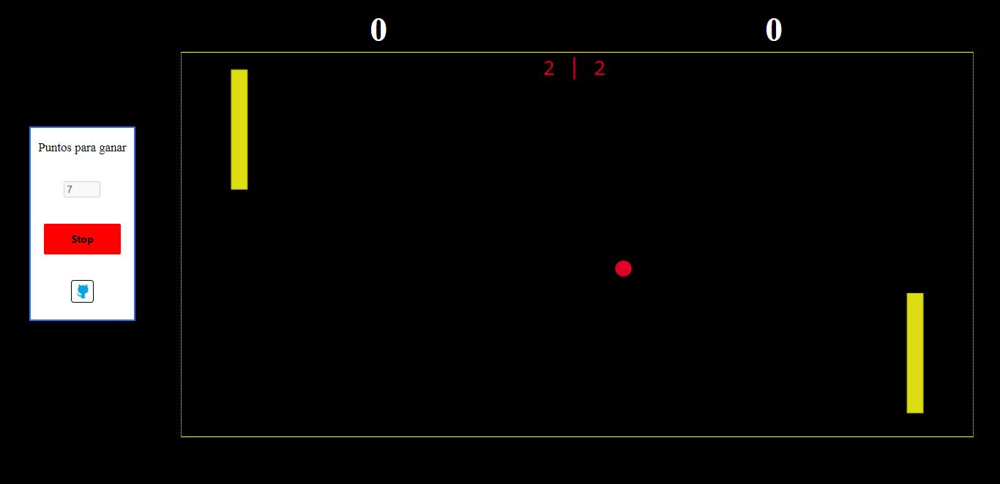

# IS-II-PONG

Pong is a table tennis sports game featuring simple two-dimensional graphics, manufactured by Atari and originally released in **1972**.

### This is a version of the classic game, programmed using JavaScript

***
- The site is published at 

### [Pong IS-II Grupo 1](https://is-ii.github.io/PONG/)
***

 
 

**Ingenieria de software, _grupo 1️⃣_**
